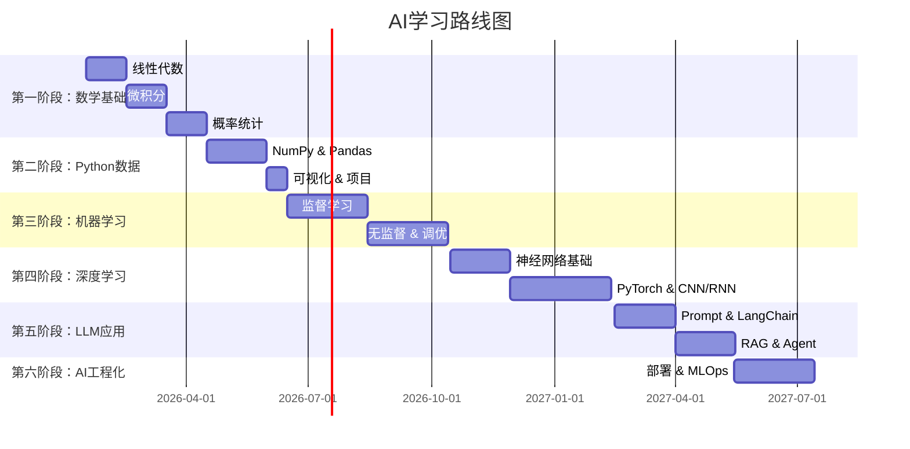

# AI学习总体路线图

## 学习者背景
*   **有Python基础**
*   **零AI基础**
*   **目标**：系统学习AI并能实际应用

## 总体时间规划
**预计总时长**：12-18个月（每周投入15-20小时）

---

## 六大学习阶段概览

### 第一阶段：数学基础补强（2-3个月）
*   **目标**：掌握AI所需的核心数学知识
*   **关键内容**：
    *   线性代数（矩阵、向量、特征值）
    *   微积分（导数、梯度、优化）
    *   概率论与统计（分布、贝叶斯、推断）
*   **完成标准**：
    *   理解矩阵运算的几何意义
    *   能计算梯度并理解梯度下降原理
    *   掌握基本概率分布及其应用
*   **详细计划**：[第一阶段-数学基础](/guide/01-math-basics/)

### 第二阶段：Python数据处理（1-2个月）
*   **目标**：熟练使用Python进行数据处理和分析
*   **关键内容**：
    *   NumPy数值计算
    *   Pandas数据分析
    *   Matplotlib/Seaborn可视化
    *   Jupyter Notebook工作流
*   **完成标准**：
    *   能高效处理结构化数据
    *   独立完成数据清洗和转换
    *   生成专业的数据可视化图表
*   **详细计划**：[第二阶段-Python数据处理](/guide/02-python-data/)

### 第三阶段：机器学习基础（3-4个月）
*   **目标**：理解经典ML算法并能应用于实际问题
*   **关键内容**：
    *   监督学习（回归、分类）
    *   无监督学习（聚类、降维）
    *   模型评估与调优
    *   Scikit-learn框架
*   **完成标准**：
    *   理解10+种经典算法原理
    *   能选择合适的算法解决问题
    *   完成3个实战项目
*   **详细计划**：[第三阶段-机器学习基础](/guide/03-ml-basics/)

### 第四阶段：深度学习（3-4个月）
*   **目标**：掌握神经网络和深度学习框架
*   **关键内容**：
    *   神经网络基础
    *   PyTorch/TensorFlow框架
    *   CNN、RNN、Transformer架构
    *   深度学习项目实战
*   **完成标准**：
    *   理解反向传播算法
    *   能搭建和训练深度网络
    *   完成2-3个DL项目
*   **详细计划**：[第四阶段-深度学习](/guide/04-deep-learning/)

### 第五阶段：大语言模型应用（2-3个月）
*   **目标**：掌握LLM应用开发技术
*   **关键内容**：
    *   Transformer架构深入
    *   Prompt Engineering
    *   LangChain框架
    *   RAG和Agent开发
*   **完成标准**：
    *   理解Transformer原理
    *   能设计有效Prompt
    *   构建LLM应用系统
*   **详细计划**：[第五阶段-大语言模型](/guide/05-llm-apps/)

### 第六阶段：AI工程化与部署（2-3个月）
*   **目标**：将AI模型集成到生产系统（发挥Java优势）
*   **关键内容**：
    *   模型部署与服务化
    *   Java + AI集成
    *   性能优化
    *   MLOps基础
*   **完成标准**：
    *   能部署ML模型到生产环境
    *   Java系统调用AI服务
    *   理解MLOps最佳实践
*   **详细计划**：[第六阶段-AI工程化](/guide/06-ai-engineering/)

---

## 学习方法论

### 1. 学习循环
理论学习 → 代码实践 → 项目应用 → 总结归纳

### 2. 每周时间分配建议
*   5小时 - 理论学习（视频、书籍）
*   8小时 - 代码实践（练习、Demo）
*   5小时 - 项目实战（综合应用）
*   2小时 - 总结笔记（知识梳理）

### 3. 学习资源类型
*   系统课程 - 建立知识体系
*   技术书籍 - 深入理解原理
*   实战项目 - 巩固应用能力
*   技术社区 - 获取最新动态

### 4. 验收标准
每个阶段结束时需要：
*   ✅ 完成知识点清单核查
*   ✅ 提交实战项目代码
*   ✅ 通过自测题/练习题
*   ✅ 撰写学习总结笔记

---

## 进度跟踪

### 当前状态
*   📁 总体路线图：已完成
*   ⏳ 第一阶段：准备中
*   ⏸️ 第二阶段：未开始
*   ⏸️ 第三阶段：未开始
*   ⏸️ 第四阶段：未开始
*   ⏸️ 第五阶段：未开始
*   ⏸️ 第六阶段：未开始

### 里程碑检查点
1.  ✅ 里程碑1（3个月后）：数学基础完成
2.  ✅ 里程碑2（5个月后）：数据处理完成
3.  ✅ 里程碑3（9个月后）：机器学习入门
4.  ✅ 里程碑4（13个月后）：深度学习入门
5.  ✅ 里程碑5（16个月后）：LLM应用开发
6.  ✅ 里程碑6（18个月后）：AI工程化能力

---

## 下一阶段行动
**当前任务**： 开始第一阶段学习
**详细内容**： 查看 [01-第一阶段-数学基础](/guide/01-math-basics/)
**预计开始时间**： 2026-01-16
**预计完成时间**： 2026-04-15
